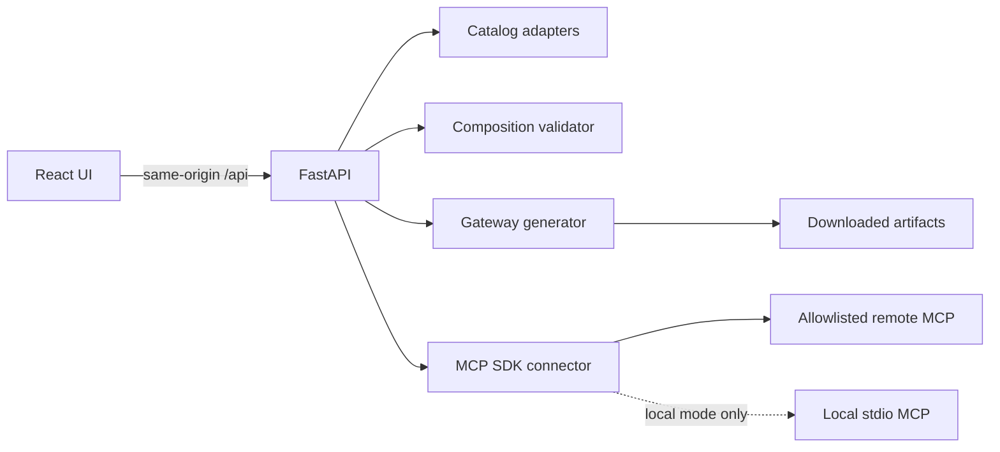

# MCP Composer

Build one focused MCP gateway from a curated set of upstream servers, tools, aliases, and permission policies.

`React 18` · `TypeScript` · `SCSS Modules` · `Vite 6` · `FastAPI` · `MCP Python SDK`

> [!IMPORTANT]
> Local mode can launch arbitrary stdio MCP commands and is intended only for a trusted workstation. Use hosted mode for deployment. Public deployments still need authentication at the reverse proxy or identity-aware gateway.

## What it does

- Searches local and external MCP catalogs.
- Adds stdio or remote HTTP MCP servers.
- Discovers live upstream tools through the official MCP SDK.
- Namespaces aliases and detects duplicate exposed names.
- Classifies read, write, external, and destructive risk.
- Applies `auto`, `require_approval`, or `disabled` permissions.
- Validates a composition before writing artifacts.
- Exports a gateway config, MCP client snippet, and generated README.
- Keeps the interface responsive from mobile screens through wide desktop monitors.

## Architecture



The production container serves the built Vite application and FastAPI from one origin. This removes the production dependency on `localhost:8000` and keeps the browser security model simple.

## Application modes

| Mode | Intended use | stdio | Remote HTTP | Origin checks | API docs |
| --- | --- | ---: | ---: | ---: | ---: |
| `local` | Trusted developer workstation | Enabled | Enabled | Optional | Enabled |
| `hosted` | Container or server deployment | Blocked | HTTPS and exact host allowlist | Required | Disabled by default |

Hosted mode also disables client-defined proxy calls until tool metadata and authorization are managed on the server.

If `APP_MODE` is omitted, startup uses the fail-closed hosted path and requires exact allowed origins and hosts. Development commands below select `local` explicitly. The production image selects `hosted`.

## Quick start

### Requirements

- Python 3.11 or newer
- Node.js 20.19 or newer
- npm 10 or newer
- Docker Engine with the Docker Compose v2 plugin for the container workflow
- GNU Make with a POSIX-compatible shell only for the optional Makefile shortcuts

### 1. Start the backend

PowerShell:

```powershell
cd backend
python -m venv .venv
.\.venv\Scripts\python.exe -m pip install --require-hashes -r requirements-dev.txt
$env:APP_MODE="local"
.\.venv\Scripts\python.exe -m uvicorn app.main:app --reload
```

Bash:

```bash
cd backend
python -m venv .venv
source .venv/bin/activate
python -m pip install --require-hashes -r requirements-dev.txt
APP_MODE=local python -m uvicorn app.main:app --reload
```

The API starts at `http://127.0.0.1:8000`.

### 2. Start the frontend

```bash
cd frontend
npm ci
npm run dev
```

Open `http://127.0.0.1:5173`. Vite proxies `/api` to the local backend, so no production API URL is baked into the bundle.

## Docker deployment

Direct Docker Compose workflow:

```bash
docker compose config --quiet
docker compose build --pull composer
docker compose up --no-build --wait --wait-timeout 60
curl http://127.0.0.1:8000/api/health
curl --head http://127.0.0.1:8000/
docker compose logs --follow composer
docker compose down --remove-orphans
```

Compose creates one `composer` container. The Node stage only builds the frontend; the final Python image serves both the Vite assets and FastAPI from port 8000. Compose binds the application to loopback, drops Linux capabilities, uses a read-only root filesystem, and runs as a non-root user. Hosted generation returns downloadable artifacts without storing user compositions in the container.

PowerShell uses the same Compose commands. Native Windows users can verify the running service without `curl`:

```powershell
docker compose up --build --wait --wait-timeout 60
Invoke-RestMethod http://127.0.0.1:8000/api/health
Invoke-WebRequest -Method Head http://127.0.0.1:8000/
docker compose down --remove-orphans
```

The Makefile shortcuts require GNU Make and a POSIX-compatible shell. On Windows, run them through WSL or Git Bash, or use the direct PowerShell commands above:

```bash
make docker-build
make docker-up
make docker-smoke
make docker-logs
make docker-down
```

`make docker-smoke` uses an isolated Compose project on port `18080`, validates health, root HEAD support, index HTML, and the hashed JavaScript asset, then removes its temporary container and network. Override the port with `MCP_COMPOSER_SMOKE_PORT`.

For a real domain:

1. Copy `.env.example` to `.env`.
2. Set `MCP_COMPOSER_ALLOWED_ORIGINS=https://composer.example.com`.
3. Add `composer.example.com,localhost,127.0.0.1` to `MCP_COMPOSER_ALLOWED_HOSTS`.
4. Add each trusted remote MCP hostname to `MCP_COMPOSER_REMOTE_HOSTS`.
5. Put the loopback-bound service behind TLS and an authentication gateway.
6. Configure request rate limits and concurrency limits at the reverse proxy.
7. Apply an outbound network policy in addition to the application SSRF checks.

Do not expose `APP_MODE=local` to a network.

## Environment variables

| Variable | Default | Purpose |
| --- | --- | --- |
| `APP_MODE` | Unset: fail-closed hosted path; image: `hosted` | Selects `local` or `hosted` security behavior. Hosted startup fails without exact origins and hosts. |
| `MCP_COMPOSER_ALLOWED_ORIGINS` | Local Vite origins | Exact browser origins accepted by CORS and Origin validation. Required in hosted mode. |
| `MCP_COMPOSER_ALLOWED_HOSTS` | Local hosts | Exact HTTP Host values accepted by TrustedHostMiddleware. Required in hosted mode. |
| `MCP_COMPOSER_REMOTE_HOSTS` | Empty | Exact remote MCP hostnames permitted in hosted mode. Empty blocks remote connections. |
| `MCP_COMPOSER_DATA_DIR` | `backend/app/generated` | Local-mode directory for generated JSON artifacts. Hosted mode does not persist them. |
| `MCP_COMPOSER_DOCS_ENABLED` | Local: true, hosted: false | Enables OpenAPI, Swagger UI, and ReDoc. |
| `MCP_COMPOSER_REQUIRE_ORIGIN` | Local: false, hosted: true | Requires Origin on state-changing API requests. |
| `MCP_COMPOSER_MAX_REQUEST_BYTES` | `1000000` | Maximum actual body size for state-changing requests. |
| `FRONTEND_DIST_DIR` | Unset | Optional Vite `dist` directory served by FastAPI. |
| `VITE_API_BASE_URL` | Empty | Optional frontend API prefix. Empty uses same-origin `/api`. |
| `VITE_DEV_API_TARGET` | `http://127.0.0.1:8000` | Backend target used only by the Vite development proxy. |

Examples are available in [`.env.example`](.env.example), [`backend/.env.example`](backend/.env.example), and [`frontend/.env.example`](frontend/.env.example). The backend does not load `.env` implicitly. Pass `--env-file .env` to Uvicorn when using a copied backend example.

## Security model

- XSS: React renders untrusted values as text, the project has no `dangerouslySetInnerHTML` sink, generated Markdown is escaped, and production responses include a restrictive CSP.
- CSRF: the application does not use cookie authentication. State-changing requests require JSON, hosted mode validates Origin, and CORS allows only explicit origins. If cookie sessions are added, add a real CSRF token flow.
- Command execution: local stdio remains intentionally powerful. Hosted mode rejects all stdio servers and uses a minimal child-process environment locally.
- SSRF: hosted remote URLs require HTTPS, an exact hostname allowlist, and public DNS/IP results. An egress firewall is still required for defense in depth.
- Permissions: tools marked `require_approval` are blocked until an approval workflow exists.
- Browser storage: runtime server configs, task details, notes, audit logs, and generated output are not persisted to localStorage. Only the gateway name and use-case preference are retained.

Read the full threat model and deployment checklist in [SECURITY.md](SECURITY.md).

## API

| Method | Endpoint | Purpose |
| --- | --- | --- |
| `GET` | `/api/health` | Health and active mode |
| `GET` | `/api/catalog` | Built-in MCP catalog |
| `GET` | `/api/catalog/search` | Paginated catalog search |
| `POST` | `/api/test-connection` | Test an upstream server |
| `POST` | `/api/discover-tools` | Discover upstream tools |
| `POST` | `/api/validate-composition` | Validate without writing files |
| `POST` | `/api/generate-gateway` | Validate and generate artifacts |
| `POST` | `/api/proxy-tool-call` | Local-only proxy seam |

## Generated gateway

Local mode writes artifacts to `backend/app/generated/` by default. Hosted mode returns them only in the response, and the UI downloads filenames that match the exported template. Generated files are ignored by Git.

Download the gateway config into `backend/app/generated/`. The exported `mcpServers` template uses `<PATH_TO_MCP_COMPOSER>` instead of a path from the backend host. Replace it with the absolute path to your local checkout. The selected Python interpreter must have the locked runtime dependencies installed.

Run a generated gateway from `backend`:

PowerShell:

```powershell
$env:APP_MODE = "local"
python -m app.gateway_server --config ./app/generated/<gateway>.gateway.config.json
```

Bash:

```bash
APP_MODE=local python -m app.gateway_server --config ./app/generated/<gateway>.gateway.config.json
```

`require_approval` tools remain unavailable in the generated runtime until a real approval flow is implemented.

## Project structure

```text
.
├── backend/
│   ├── app/
│   │   ├── api/               FastAPI routes
│   │   ├── core/              catalog, validation, security, connector, generation
│   │   ├── data/              starter MCP definitions
│   │   └── gateway_server.py  generated gateway runtime
│   └── tests/
├── frontend/
│   ├── src/
│   │   ├── components/        memoized React components and SCSS Modules
│   │   ├── lib/               API, storage, types, utilities
│   │   └── styles/            global tokens, mixins, and reset
│   └── vite.config.ts
├── compose.yaml
└── Dockerfile
```

## Quality checks

Frontend:

```bash
cd frontend
npm run check
npm audit
```

`npm run check` runs linting, formatting verification, render isolation tests, and the production build.

Backend:

```bash
cd backend
ruff check .
ruff format --check .
python -m compileall app
python -m pytest
```

The CI workflow runs frontend checks, backend tests, a production container build, its Docker healthcheck, and same-origin static serving smoke tests.

Dependency input files are `backend/requirements.in` and `backend/requirements-dev.in`. Regenerate the portable hash-locked files with:

```bash
cd backend
uv pip compile --universal --python-version 3.11 --generate-hashes requirements.in --output-file requirements.txt
uv pip compile --universal --python-version 3.11 --generate-hashes requirements-dev.in --output-file requirements-dev.txt
```

## Contributing

See [CONTRIBUTING.md](CONTRIBUTING.md). Keep changes focused, include tests for security-sensitive behavior, and never commit secrets or generated gateway configs.
